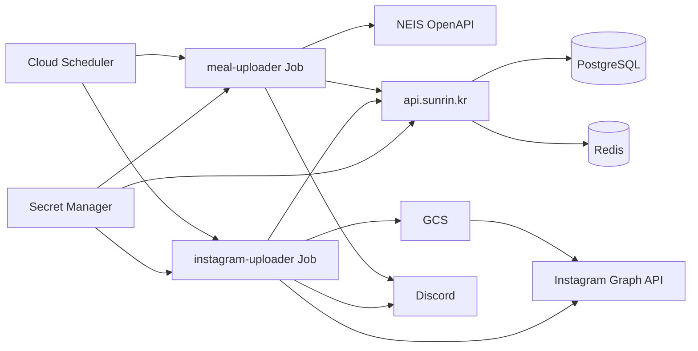

# 선린투데이

선린인터넷고등학교 급식 서비스입니다.

- [api](https://github.com/sunrin-today/api) — 급식 조회/쓰기
- [meal-uploader](https://github.com/sunrin-today/meal-uploader) — NEIS → API
- [instagram-uploader](https://github.com/sunrin-today/instagram-uploader) — API → Instagram [@sunrin_today](https://instagram.com/sunrin_today)

## 아키텍처

