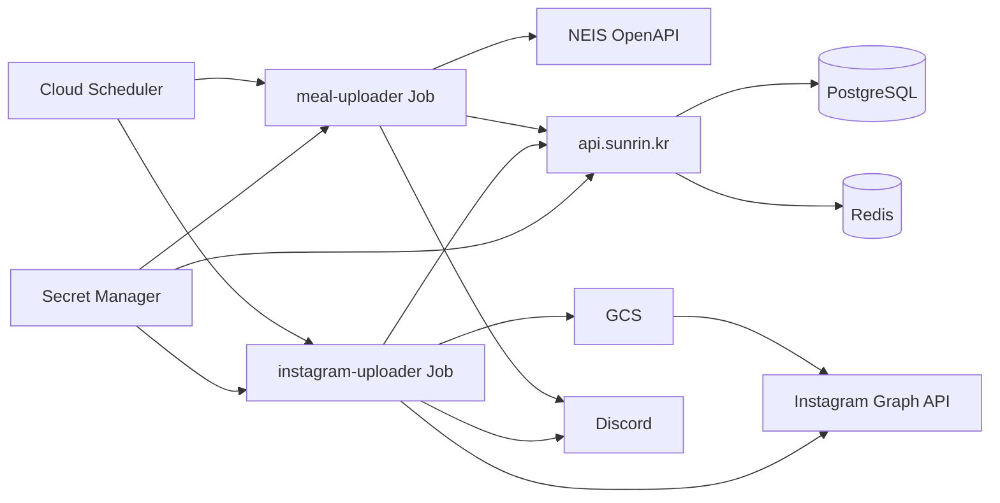

# Sunrin Today

선린인터넷고등학교 급식 서비스 · [@sunrin_today](https://instagram.com/sunrin_today)

- [api](https://github.com/sunrin-today/api) — 급식 조회/쓰기
- [meal-uploader](https://github.com/sunrin-today/meal-uploader) — 나이스 → API
- [instagram-uploader](https://github.com/sunrin-today/instagram-uploader) — API → Instagram

## 아키텍처

### Administrator

- [Jeewon Kwon](https://github.com/jwkwon0817)
- [Sungju Cho](https://github.com/iamfiro)
